

<!-- HERO BANNER (1200x600) -->
<picture>
  <source media="(prefers-color-scheme: dark)" srcset="assets/hero-dark.svg">
  
</picture>

  

<!-- ACTION LINK PILLS (48px) -->
<a href="https://github.com/nikhildasari12" target="_blank">
  <picture>
    <source media="(prefers-color-scheme: dark)" srcset="assets/btn-github-dark.svg">
    
  </picture>
</a>
&nbsp;
<a href="https://www.linkedin.com/in/dasari-nikhil" target="_blank">
  <picture>
    <source media="(prefers-color-scheme: dark)" srcset="assets/btn-linkedin-dark.svg">
    
  </picture>
</a>
&nbsp;
<a href="https://nikhil-dasari-portfolio.netlify.app/" target="_blank">
  <picture>
    <source media="(prefers-color-scheme: dark)" srcset="assets/btn-portfolio-dark.svg">
    
  </picture>
</a>
&nbsp;
<a href="mailto:dasarinikhil121@gmail.com">
  <picture>
    <source media="(prefers-color-scheme: dark)" srcset="assets/btn-email-dark.svg">
    
  </picture>
</a>

 

<!-- ======================= 01 · ABOUT & RADAR ======================= -->
<picture>
  
</picture>

I am a **Machine Learning Engineer** based in Bangalore specializing in Computer Vision, OCR, and Generative AI systems. I transform complex visual research into production-grade, highly resilient pipelines that solve real-world problems.

My work centers on the entire machine learning lifecycle—diagnosing critical dataset failures, training transformer-based visual representations, fine-tuning multimodal vision-language models, and orchestrating serverless AI inference on AWS.

 

<!-- NOW / RADAR GLASS CARD -->
<picture>
  
</picture>

  

<!-- ======================= 02 · FEATURED ARTIFACTS ======================= -->
<picture>
  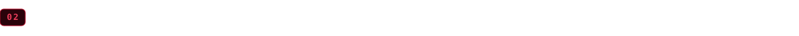
</picture>

<!-- ROW 1 -->
<a href="https://github.com/nikhildasari12/imgraft" target="_blank">
  
</a>
&nbsp;
<a href="https://github.com/nikhildasari12/transformers-ocr" target="_blank">
  
</a>

  <b>Left:</b> Automated semantic dataset curation resolving silent data corruption · <b>Right:</b> End-to-end transformer-based digit and document text extraction

 

<!-- ROW 2 -->
<a href="https://github.com/nikhildasari12/Lung-CT-cancer-detection-with-EfficientNet-B0-PyTorch-" target="_blank">
  
</a>
&nbsp;
<a href="https://github.com/nikhildasari12/LAN-Sentinel-Local-Network-Security-Scanner" target="_blank">
  
</a>

  <b>Left:</b> Medical imaging diagnostic benchmark with precision-recall evaluation · <b>Right:</b> Automated network vulnerability discovery and external surface analysis

 

<!-- ======================= 03 · TECHNICAL WEAPONS ======================= -->
<picture>
  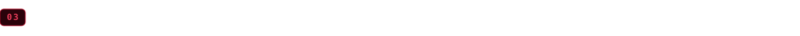
</picture>

<picture>
  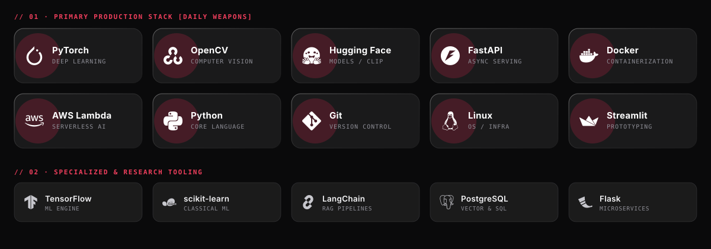
</picture>

 

<b>View complete technical arsenal breakdown</b>

 

- **Computer Vision & Deep Learning**: PyTorch, OpenCV, YOLO, CLIP, SVTR, EfficientNet, HDBSCAN, scikit-learn, CutMix augmentation.
- **Generative AI & Multimodal LLMs**: Vision-Language Models (VLMs), QLoRA / LoRA fine-tuning, RAG pipelines, LangChain, Vector Embeddings.
- **Cloud & MLOps Infrastructure**: Docker, AWS Lambda, Amazon ECR, API Gateway, FastAPI, Flask, Linux, CI/CD Actions.
- **Languages & Databases**: Python, SQL, PostgreSQL, Bash.

  

<!-- ======================= 04 · LIVE TELEMETRY ======================= -->
<picture>
  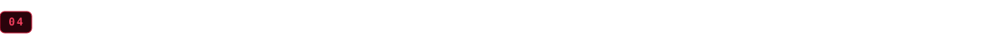
</picture>

<picture>
  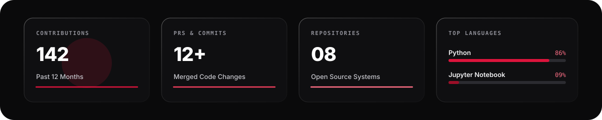
</picture>

  

<picture>
  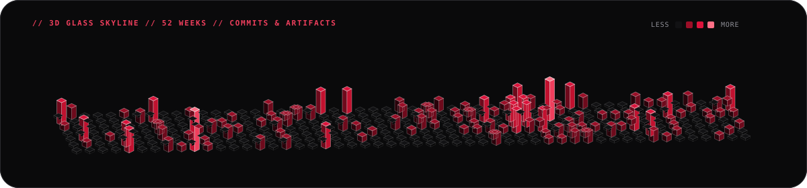
</picture>

  

<!-- ======================= FOOTER ======================= -->
<picture>
  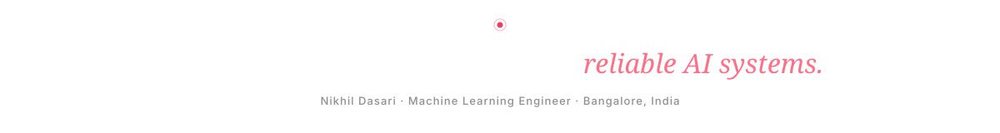
</picture>

  
    Designed in Crimson Glass · Base64 WOFF2 Type (Syne, Instrument Serif, Inter Tight, JetBrains Mono) · Vector 3D via SMIL · Refreshed daily via GitHub Actions
  
    
  
    <b>Connect:</b>
    <a href="https://github.com/nikhildasari12">GitHub</a> ·
    <a href="https://www.linkedin.com/in/dasari-nikhil">LinkedIn</a> ·
    <a href="https://nikhil-dasari-portfolio.netlify.app/">Portfolio</a> ·
    <a href="mailto:dasarinikhil121@gmail.com">Email</a>
  

